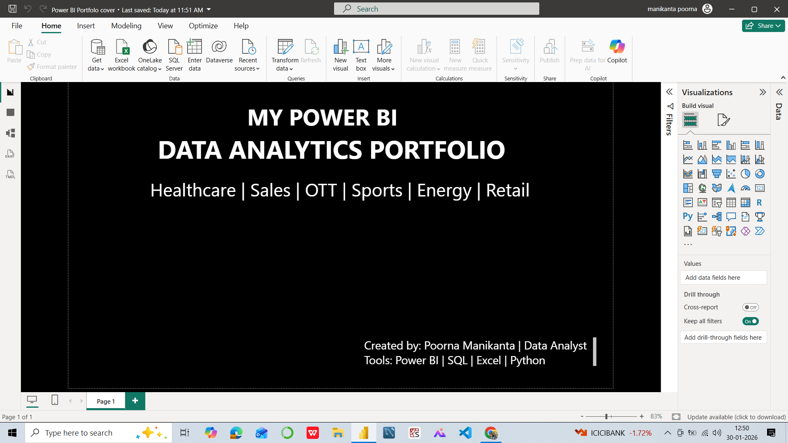
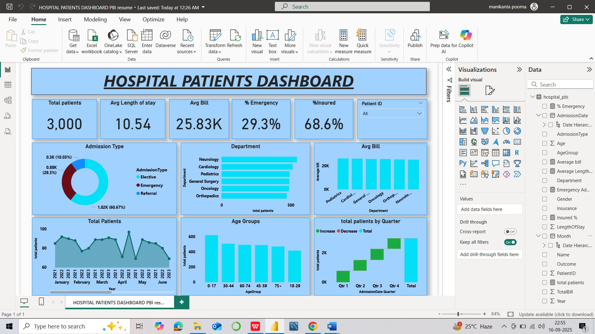
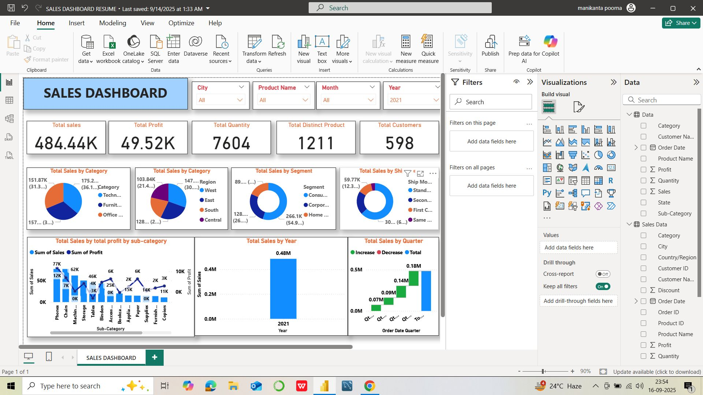
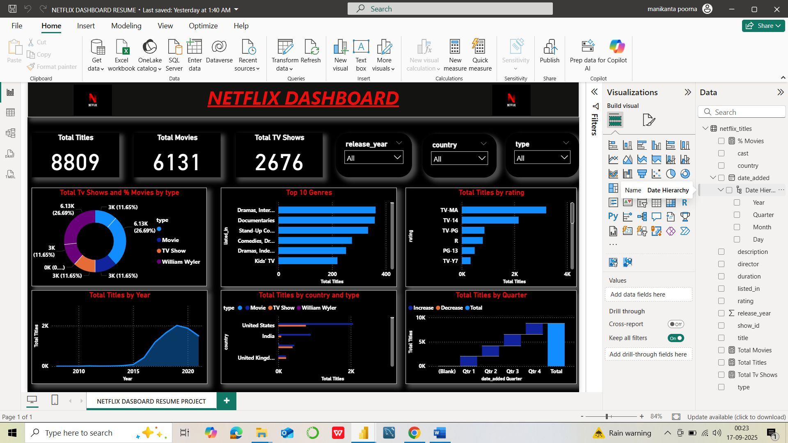
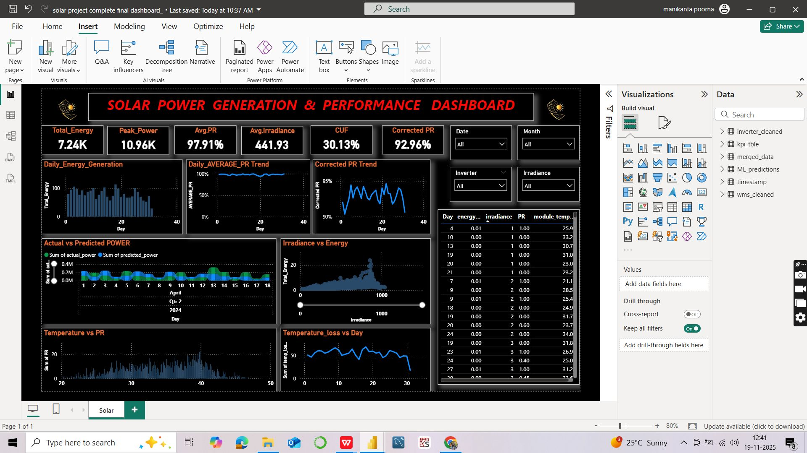
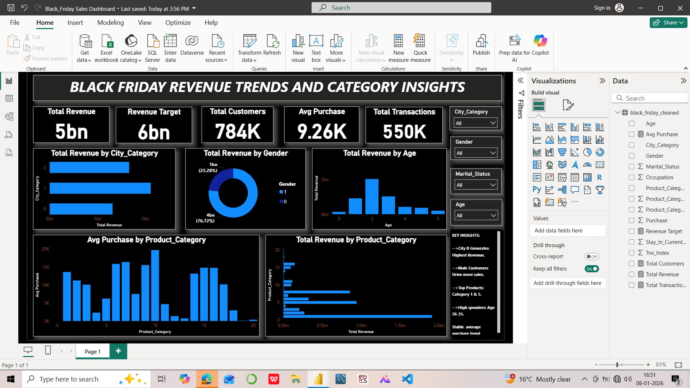

# Power BI Data Analytics Portfolio

## Domains Covered
Healthcare | Sales | OTT (Netflix) | Sports | Energy | Retail

## Tools Used
- Power BI (DAX, Data Modeling)
- SQL
- Excel
- Python (EDA)

## About This Portfolio
This repository showcases multiple end-to-end Power BI dashboards built to solve real-world business problems.
The dashboards focus on KPIs, trends, performance analysis, and decision support.

---

## Dashboard Gallery

### Power BI Dashboard Portfolio

### Healthcare Dashboard

### Sales Performance Dashboard

### Netflix / OTT Dashboard

### Olympic Medals Dashboard

### Solar Power Generation Dashboard

### Black Friday Revenue Dashboard

## Key Skills Demonstrated
- KPI design and DAX measures
- Interactive filters & slicers
- Business storytelling
- Trend & performance analysis
- Data cleaning & validation

## About Me
**Poorna Manikanta**  
Data Analyst | Power BI | SQL | Python  
4+ years experience in Data Operations & Reporting (CRPF)

🔗 LinkedIn: https://www.linkedin.com/in/poorna-manikanta-ai-ml
